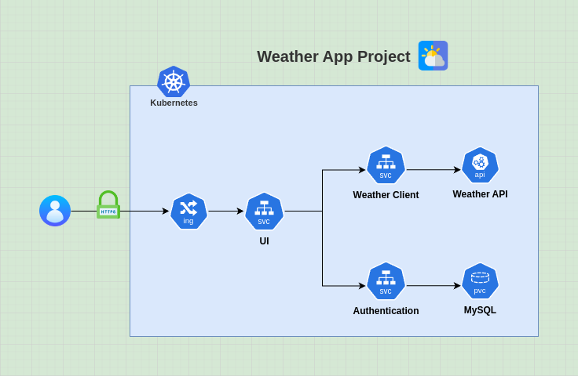
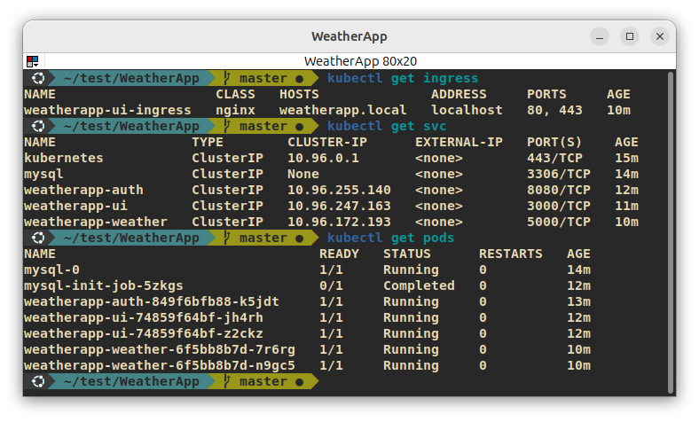
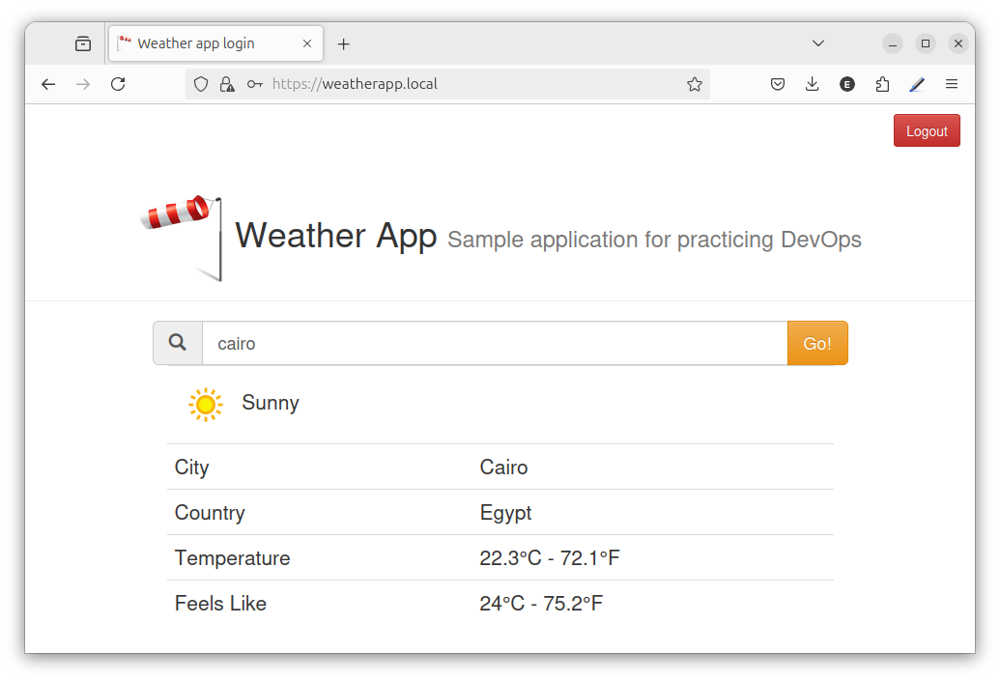

# WeatherApp Project

Welcome to the **WeatherApp** project! This project demonstrates a Kubernetes-based microservices architecture for a weather application that includes authentication, a user interface, and a weather service. Each service is containerized and managed within a Kubernetes cluster, allowing for efficient scaling, resilience, and modular maintenance.

## Architecture Diagram

Below is the architecture diagram of the WeatherApp project, illustrating how each component interacts within the Kubernetes cluster:




## Project Structure

```
.
├── auth
│   ├── deployment.yml
│   ├── mysql
│   │   ├── headless-service.yml
│   │   ├── init-job.yml
│   │   └── statefulset.yml
│   └── service.yml
├── diagram
│   ├── diagram.png
│   ├── project-test.png
│   └── terminal-checks.png
├── ui
│   ├── deployment.yml
│   ├── ingress.yml
│   ├── service.yml
│   ├── tls.crt
│   └── tls.key
└── weather
    ├── deployment.yml
    └── service.yml
```

- **auth/**: Contains the Kubernetes manifests for the Authentication Service and MySQL database setup.
- **ui/**: Contains the Kubernetes manifests for the User Interface Service and its Ingress configuration.
- **weather/**: Contains the Kubernetes manifests for the Weather Service.
- **diagram/**: Contains architectural diagrams and terminal screenshots.

## Terminal Checks

After setting up the cluster and deploying the services, you can verify that the pods and services are running by checking the following image:



## Project Test Diagram

The following image shows an additional test diagram for the project:



## Setting Up the KinD Cluster for Ingress

To set up the KinD cluster for Ingress, delete any existing KinD cluster and recreate it with the configuration below.

### 1. Delete Existing KinD Cluster (if any)

```bash
kind delete cluster
```

### 2. Create a New KinD Cluster with Ingress Configuration

```bash
cat <<EOF | kind create cluster --config=-
kind: Cluster
apiVersion: kind.x-k8s.io/v1alpha4
nodes:
- role: control-plane
  kubeadmConfigPatches:
  - |
    kind: InitConfiguration
    nodeRegistration:
      kubeletExtraArgs:
        node-labels: "ingress-ready=true"
  extraPortMappings:
  - containerPort: 80
    hostPort: 80
    protocol: TCP
  - containerPort: 443
    hostPort: 443
    protocol: TCP
EOF
```

### 3. Install the Ingress Controller

```bash
kubectl apply -f https://raw.githubusercontent.com/kubernetes/ingress-nginx/main/deploy/static/provider/kind/deploy.yaml
```

## Services Overview

### 1. Authentication Service (`auth/`)

The **Authentication Service** is responsible for managing user authentication and authorization. It uses a MySQL database to store user credentials and related information.

- **Files**:
  - `deployment.yml`: Defines the deployment for the authentication service.
  - `service.yml`: Creates a ClusterIP service for internal communication.
  - `mysql/`: Contains the configuration for MySQL, including a StatefulSet, headless service, and an initialization job.
- **Read More**: [Auth README](auth/README.md)

### 2. User Interface Service (`ui/`)

The **User Interface (UI) Service** provides the front-end for users to interact with the application. It uses an Ingress resource to expose the UI over HTTPS, making it accessible from outside the cluster.

- **Files**:
  - `deployment.yml`: Defines the deployment for the UI service.
  - `service.yml`: Creates a ClusterIP service for internal communication.
  - `ingress.yml`: Configures the Ingress to expose the UI service via HTTPS.
  - `tls.crt` and `tls.key`: Self-signed SSL certificate and key files for securing the Ingress.
- **Read More**: [UI README](ui/README.md)

### 3. Weather Service (`weather/`)

The **Weather Service** retrieves weather data from an external API and makes it available within the cluster for other services to consume.

- **Files**:
  - `deployment.yml`: Defines the deployment for the Weather Service.
  - `service.yml`: Creates a ClusterIP service for internal communication.
- **Read More**: [Weather README](weather/README.md)

## Prerequisites

- **Kubernetes Cluster**: Ensure you have a running Kubernetes cluster (local or cloud-based).
- **kubectl**: Kubernetes command-line tool for deploying and managing resources.
- **openssl**: Used for generating a self-signed SSL certificate.

## Setup Instructions

### 1. Clone the Repository

```bash
git clone https://github.com/your-username/WeatherApp.git
cd WeatherApp
```

### 2. Set Up the MySQL Secret

Create a Kubernetes secret to store the MySQL credentials and any other sensitive information:

```bash
kubectl create secret generic mysql-secret \
  --from-literal=root-password=<root_password> \
  --from-literal=auth-password=<auth_password> \
  --from-literal=secret-key=<secret_key>
```

### 3. Set Up the Weather API Key Secret

The Weather Service requires an API key to access the external weather API. Create a Kubernetes secret to store this API key:

```bash
kubectl create secret generic weather --from-literal=apikey=<your_api_key>
```

### 4. Generate a Self-Signed SSL Certificate for Ingress

To enable HTTPS access for the UI service, generate a self-signed SSL certificate:

```bash
openssl req -x509 -nodes -days 365 -newkey rsa:2048 -keyout ui/tls.key -out ui/tls.crt -subj "/CN=example.com/O=example.com"
```

Then, create a Kubernetes secret from the generated certificate and key:

```bash
kubectl create secret tls weatherapp-ui-tls --cert=ui/tls.crt --key=ui/tls.key
```

### 5. Update `/etc/hosts`

To access the UI service via `https://weatherapp.local`, add the following entry to your `/etc/hosts` file:

```plaintext
127.0.0.1 weatherapp.local
```

### 6. Deploy the Services

Deploy each service in the following order:

1. **Authentication Service**:
   ```bash
   kubectl apply -f auth/mysql/headless-service.yml
   kubectl apply -f auth/mysql/statefulset.yml # Wait a moment for container creating
   kubectl apply -f auth/mysql/init-job.yml
   kubectl apply -f auth/deployment.yml
   kubectl apply -f auth/service.yml
   ```

2. **User Interface Service**:
   ```bash
   kubectl apply -f ui/deployment.yml
   kubectl apply -f ui/service.yml
   kubectl apply -f ui/ingress.yml
   ```

3. **Weather Service**:
   ```bash
   kubectl apply -f weather/deployment.yml
   kubectl apply -f weather/service.yml
   ```

### 7. Access the Application

Once everything is deployed, you should be able to access the User Interface through `https://weatherapp.local`. Ensure that the `/etc/hosts` file is updated as described in Step 5.

## Author
- **Mohamed Eid** - [GitHub Profile](https://github.com/moeid404)  
  Email: moeid404@gmail.com

Feel free to reach out to me for any questions, issues, or contributions.